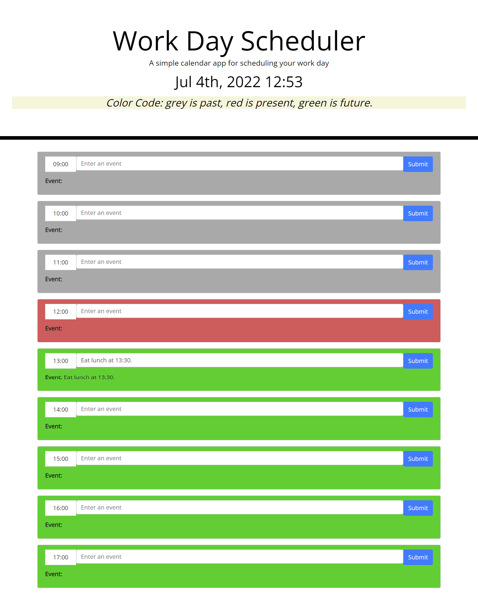

# Work-Day-Scheduler
Module 5 Challenge: Work Day Scheduler by Sergey Holin

GitHub Repo Link: https://github.com/sergeyholin/Work-Day-Scheduler

Live Application Link: https://sergeyholin.github.io/Work-Day-Scheduler/

NOTES: If you check the app any time after 17:00, all timeblocks will be grey, because the app will see them as past events for the day. If you check the app before 09:00, all time blocks will be green, because the app will see them as future events for the day.

ABOUT THE APP:

Work Day Scheduler is a simple calendar application that allows a user to save events for each hour of the day.

ACCEPTANCE CRITERIA:

GIVEN I am using a daily planner to create a schedule
WHEN I open the planner
THEN the current day is displayed at the top of the calendar
WHEN I scroll down
THEN I am presented with timeblocks for standard business hours
WHEN I view the timeblocks for that day
THEN each timeblock is color coded to indicate whether it is in the past, present, or future
WHEN I click into a timeblock
THEN I can enter an event
WHEN I click the save button for that timeblock
THEN the text for that event is saved in local storage
WHEN I refresh the page
THEN the saved events persist

ADDITIONAL CRITERIA:

Application deployed at live URL.

SCREENSHOT:

